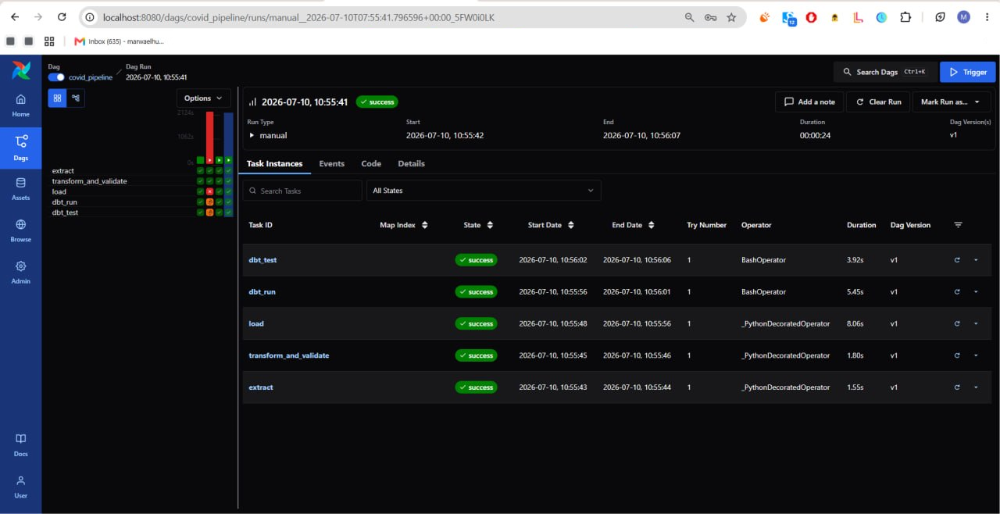
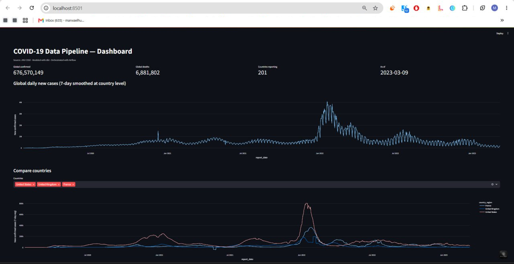

# COVID-19 Data Pipeline

A daily-batch data pipeline that ingests JHU CSSE COVID-19 time-series data,
validates it, models it with dbt, and serves it through an interactive
dashboard — orchestrated end-to-end with Airflow.

Built as a modernized take on a classic "clean the COVID CSVs" practice
project: same underlying dataset, production-shaped architecture.

## Architecture


Orchestrated as a single Airflow DAG (`dags/covid_pipeline_dag.py`):
`extract → transform_and_validate → load → dbt_run → dbt_test`.

## Why it's built this way

- **Full-refresh, not incremental.** JHU republishes and corrects historical
  data on every run, so an append-only load would drift from the source of
  truth. The raw table is fully replaced each run; this is a deliberate
  tradeoff documented in `load.py`, not an oversight.
- **Negative deltas are flagged, not dropped.** Retroactive corrections
  produce negative day-over-day counts. Silently clipping them to zero would
  hide real data quality issues, so they're carried through as
  `is_data_correction` and surfaced in the dashboard.
- **Data quality is its own pipeline stage.** `pandera` schema validation
  runs between transform and load as a distinct, failable Airflow task —
  a bad run fails loudly before it reaches the warehouse, not silently
  downstream in a dashboard.
- **dbt owns everything past the raw table.** Python does extraction,
  cleaning, and validation; dbt does all business-logic transformation
  (rollups, 7-day averages, case-fatality rate). This mirrors how these
  responsibilities are split on real data teams.

## Stack

| Layer | Tool |
|---|---|
| Ingestion | Python (requests, pandas) |
| Data quality | pandera |
| Warehouse | Postgres (local) / RDS free tier (optional, via Terraform) |
| Transformation | dbt |
| Orchestration | Airflow 3 |
| Dashboard | Streamlit + Plotly |
| CI | GitHub Actions (lint, unit tests, full dbt build against ephemeral Postgres) |
| IaC | Terraform (optional AWS RDS target) |

## Screenshots


*All 5 pipeline tasks completing successfully*


*Streamlit dashboard showing global COVID trends*
## Running it

```bash
cp .env.example .env
docker compose up --build
```

- Airflow UI: http://localhost:8080 (admin/admin) — trigger `covid_pipeline`
- Dashboard: http://localhost:8501 (populates after the DAG's first successful run)
- Postgres: localhost:5432 (db `covid`, user/pass `airflow`/`airflow`)

## Running tests locally (no Docker needed)

```bash
pip install -r requirements.txt
pytest tests/ -v
ruff check src/ tests/ dags/
```

## Running dbt locally against DuckDB (no Postgres needed)

```bash
cd dbt/covid_dbt
DBT_PROFILES_DIR=. dbt run --target ci
DBT_PROFILES_DIR=. dbt test --target ci
```

## Optional: deploy the warehouse to AWS free tier

```bash
cd terraform
terraform init
terraform apply -var="db_password=<your-password>"
```

Then point `WAREHOUSE_URL` at the printed RDS endpoint instead of the local
Postgres container.

## Project structure

```
.
├── dags/covid_pipeline_dag.py       # Airflow DAG
├── src/ingestion/                   # extract, transform, load
├── src/data_quality/checks.py       # pandera validation
├── dbt/covid_dbt/                   # staging + marts models, tests
├── dashboard/app.py                 # Streamlit dashboard
├── tests/                           # pytest unit tests for transform logic
├── terraform/                       # optional AWS RDS provisioning
└── .github/workflows/ci.yml         # lint + unit tests + full dbt build
```

## Data source

[JHU CSSE COVID-19 Data Repository](https://github.com/CSSEGISandData/COVID-19)
(time-series confirmed cases and deaths, global).
